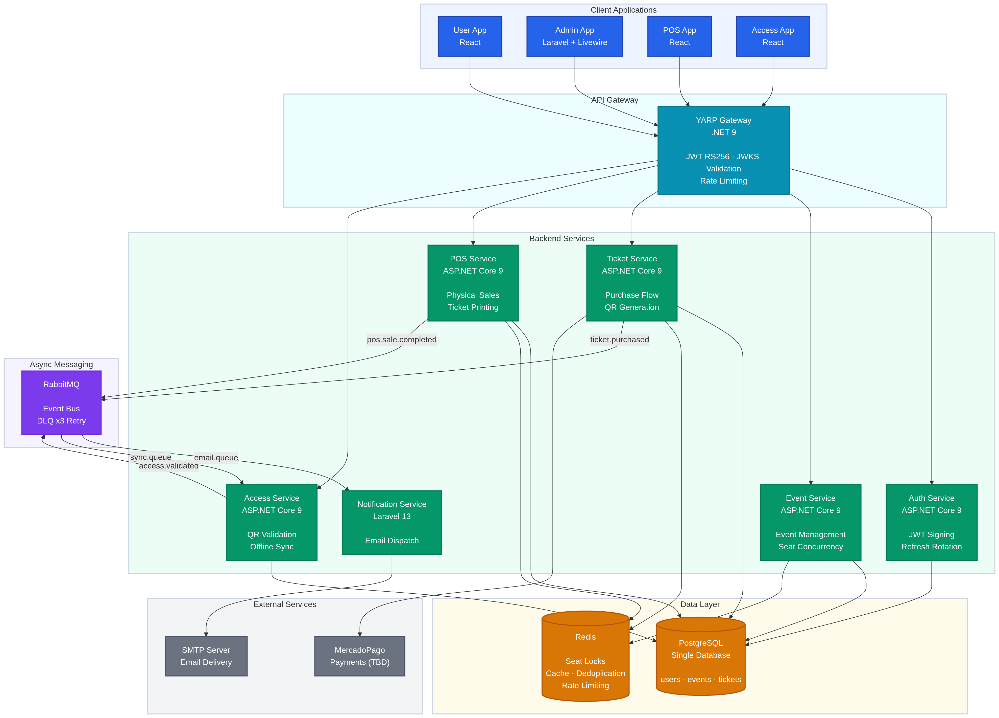
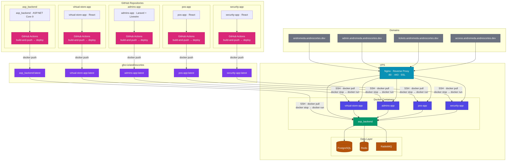
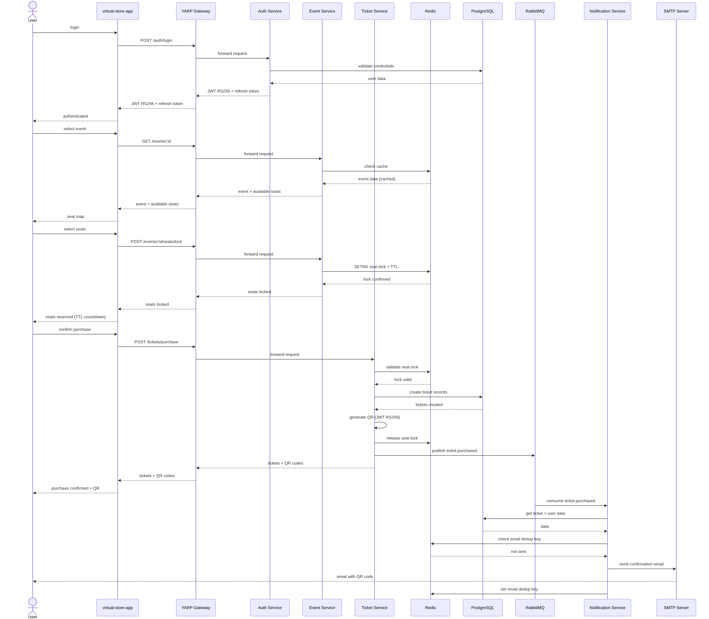
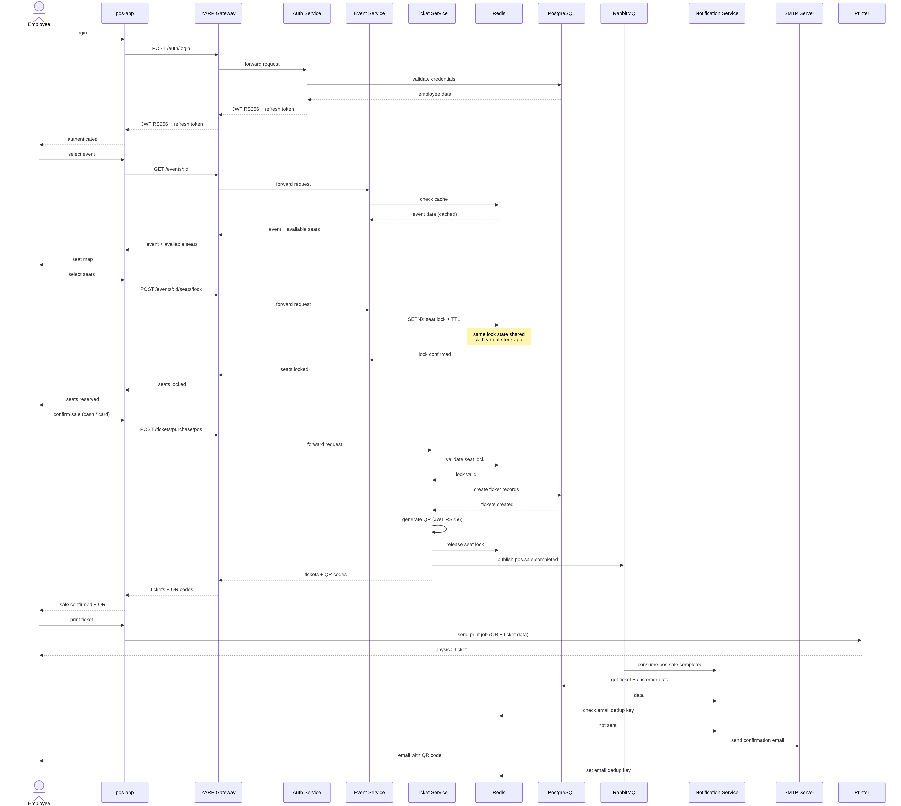
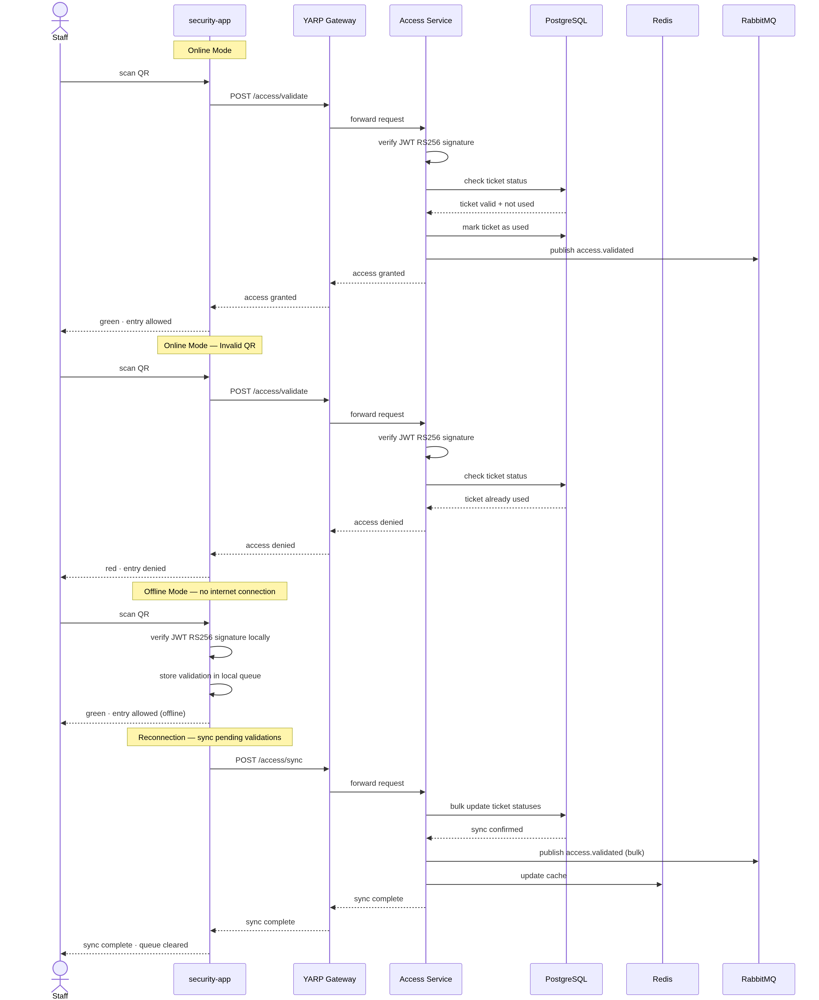

# Andromeda — Architecture Documentation

Ticketing and event management platform built on a microservices architecture.
Each application is independently deployed and communicates through a central
API Gateway and an asynchronous message broker.

---

## Table of Contents

- [Stack](#stack)
- [Applications](#applications)
- [Architecture Decisions](#architecture-decisions)
- [Diagrams](#diagrams)
- [Database Documentation](#database-documentation)
- [How to View Diagrams](#how-to-view-diagrams)

---

## Stack

| Layer          | Technology                          |
|----------------|-------------------------------------|
| Frontends      | Blazor WASM PWA · Laravel Livewire  |
| API Gateway    | YARP (.NET 9)                       |
| Services       | .NET 9 · Laravel 12                 |
| Database       | PostgreSQL (single DB)              |
| Cache & Locks  | Redis                               |
| Messaging      | RabbitMQ                            |
| Email          | SMTP                                |
| Payments       | MercadoPago _(TBD)_                 |

---

## Applications

| App        | Domain                               | Technology          | Team     |
|------------|--------------------------------------|---------------------|----------|
| User App   | andromeda.andrescortes.dev           | Blazor WASM PWA     | Alpha    |
| Admin App  | admin.andromeda.andrescortes.dev     | Laravel + Livewire  | Beta     |
| POS App    | tickets.andromeda.andrescortes.dev   | Blazor WASM PWA     | Gamma    |
| Access App | access.andromeda.andrescortes.dev    | Blazor WASM PWA     | Delta    |

---

## Architecture Decisions

Key decisions made during the design phase and the reasoning behind each one.

| Decision        | Choice                 | Reason                                                          |
|-----------------|------------------------|-----------------------------------------------------------------|
| API Gateway     | YARP (.NET 9)          | Native .NET ecosystem, no extra container, configurable via `appsettings.json` |
| Database        | PostgreSQL (single DB) | 3 core entities (`users`, `events`, `tickets`) guide the flow — Redis handles concurrency pressure |
| Concurrency     | Redis SETNX TTL 720s   | Atomic seat locking without DB-level locks or race conditions   |
| Async messaging | RabbitMQ               | Decouples services — if a consumer is down, messages persist and retry (DLQ x3) |
| Auth tokens     | JWT RS256              | Stateless — validated at gateway level via JWKS, services never call Auth directly |
| QR tokens       | JWT RS256 (signed)     | Reuses existing RS256 infrastructure, verifiable offline, non-sequential and non-predictable |
| Email delivery  | SMTP                   | No external vendor dependency — provider configurable per environment via env vars |
| Cache / queues  | Redis                  | Event response cache, email deduplication, and rate limiting via key strategy |

### Why a single database

A common microservices pattern is one database per service. For Andromeda, the
decision was made to use a single PostgreSQL instance with logical separation
by schema ownership. This is justified by three factors:

- The three core tables (`users`, `events`, `tickets`) are the source of truth
  for all business flows. Supporting tables extend them without creating
  cross-service coupling.
- Redis handles all concurrency-sensitive operations (seat locking, rate
  limiting), so the database is never a bottleneck for high-contention writes.
- The team size and project scope do not require the operational overhead of
  managing eight separate database instances.

---
## Diagrams

### System

| Diagram | Preview |
|---------|---------|
| **System Architecture** — Full overview: frontends, gateway, services, data layer, external services |  |
| **Deployment — Docker Compose** — All containers, ports, and network connections |  |

### Business Flows

| Diagram | Preview |
|---------|---------|
| **Ticket Purchase Flow** — End-to-end: login → seat selection → payment → QR generation → email |  |
| **POS Sale Flow** — Physical ticket sale, shared Redis state with web, print flow |  |
| **Access Control Flow** — QR validation: online mode, offline mode, reconnection sync |  |

### Infrastructure

| Diagram | Preview |
|---------|---------|
| **Event Bus — RabbitMQ** — All events, publishers, consumers, and routing |  |
| **JWT Auth Flow** — RS256 signing, JWKS validation at gateway, refresh token rotation |  |
| **Seat Concurrency — Redis** — SETNX lock flow, contiguous seat validation, TTL expiry |  |
| **Redis Flow Control** — All Redis key strategies and their effect on system behavior |  |

---

## Database Documentation

See [database/README.md](./database/README.md) 

Covers: schema overview, core tables, supporting tables, indexes, migrations,
and seed data.

---

## Repository Structure

```
andromeda-docs/
│
├── README.md
│
├── architecture/
│   ├── 01-system-overview.md
│   ├── 02-yarp-gateway.md
│   ├── 03-microservices.md
│   ├── 04-redis-strategy.md
│   └── 05-rabbitmq-messaging.md
│
├── diagrams/
│   ├── 01-system-architecture.png
│   ├── 02-purchase-flow.png
│   ├── 03-pos-flow.png
│   ├── 04-access-control-flow.png
│   ├── 05-event-bus.png
│   ├── 06-jwt-auth-flow.png
│   ├── 07-seat-concurrency.png
│   ├── 08-redis-flow.png
│   └── 09-deployment.png
│
└── database/
    └── README.md
```
