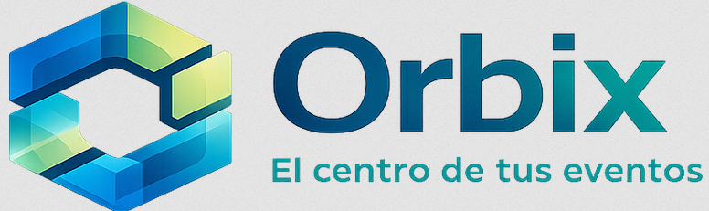

---

# Brand Identity

Orbix is designed as a modern event management platform focused on organization, scalability, and user experience.  
The visual identity reflects technology, connectivity, and innovation through a clean and professional design language.

---

# Main Logo

The official Orbix logo will be used as the primary visual identity across the platform, including:

- Landing page
- Authentication screens
- Dashboard
- Documentation
- Marketing materials

---

# Official Color Palette


The selected palette represents stability, technology, professionalism, and modern digital experiences.

| Color Preview | Hex Code | Usage |
|---------------|-----------|--------|
| Dark Blue | `#071F7A` | Main backgrounds and navigation |
| Royal Blue | `#1450A3` | Buttons and active elements |
| Teal | `#0FA3A1` | Secondary sections and highlights |
| Light Green | `#D8F0B0` | Soft accents and success indicators |

---

# Visual Design Guidelines

The Orbix platform will follow a modern UI/UX approach with:

- Clean layouts
- Responsive design
- Consistent spacing
- Professional typography
- Smooth color transitions
- Minimalist components
- Accessible user interface

---

# Frontend Structure

```text
Frontend
│
├── assets
├── components
├── services
├── pages
├── layouts
├── styles
└── utils
```

---

# Backend Architecture

The frontend communicates with the backend using REST APIs.

Example endpoints:

```http
GET /api/events
POST /api/login
PUT /api/users/{id}
DELETE /api/events/{id}
```

---

# Technologies

| Layer | Technology |
|-------|-------------|
| Frontend | HTML, CSS, JavaScript |
| Backend | ASP.NET Core |
| Database | PostgreSQL |
| Cache | Redis |
| Containerization | Docker |

---

# Project Objectives

The purpose of Orbix is to provide a centralized and scalable solution for event management.

Main goals include:

- Efficient event organization
- Modern and intuitive interfaces
- High system scalability
- Backend reusability
- Fast performance using cache systems
- Modular architecture for future expansion

---

# Future Improvements

Future documentation may include:

- API documentation
- Database diagrams
- Authentication flow
- Docker deployment
- CI/CD pipelines
- Security architecture
- Microservices structure

---

# Notes

This document represents the initial branding and technical direction for the Orbix platform and may evolve during development phases.
